# Admin Flow — Visual Site-Intelligence Workspace Documentation

## 1. Executive Summary & Objective

The **Admin Flow Location Pattern Analysis** page (`/admin-flow/patterns/location/`) has been rebuilt as an executive **Visual Site-Intelligence Workspace**, inspired by:
- **Reference A**: Dark analytical matrix dashboard with compact KPI summary cards, cross-dimensional rule/activity correlation tables, intensity-coded matrix cells, and exact observation accounting.
- **Reference B**: Interactive site schematic map with facility layout blocks, color-coded observation density indicators, zoom controls, and a persistent right-hand zone inspection panel.

This implementation strictly adheres to all operational and architectural principles of the Foresight platform:
1. **Admin Flow Isolation**: Modifies strictly Admin Flow components (`apps/admin_flow/pattern_engine.py` and `templates/admin_flow/location_pattern_analysis.html`). No global analytics or shared production services modified.
2. **Defensible Semantics**: Zero causal assertions. Legend is titled **`INCIDENT OBSERVATION DENSITY`**; heat levels correspond strictly to historical incident frequency within the site perimeter.
3. **No Fabricated Coordinates**: Uses internal facility zone identifiers and schematic grid layouts without inventing latitude/longitude.
4. **100% Data Reconciliation**: Explicitly distinguishes between specific facility blocks and general/unassigned narratives, ensuring `geotagged (16) + unassigned (34) = 50 total records` in the benchmark demonstration dataset.

---

## 2. Architecture & Data Contracts

### 2.1 Backend Facade (`apps/admin_flow/pattern_engine.py`)

The function `get_admin_flow_location_pattern_view_data()` provides the authoritative view data payload:

| Data Contract Key | Type | Description |
|---|---|---|
| `summary.card1` | `Dict` | **Highest Observation Concentration**: Location name, incident count, share of total (%), PSIF count, neutral callout. |
| `summary.card2` | `Dict` | **Operating Zones Represented**: Active physical zones with observations out of total mapped site zones. |
| `summary.card3` | `Dict` | **PSIF-Linked Concentration**: Total high-energy precursor volume and overall rate among matched observations. |
| `summary.card4` | `Dict` | **Location Attribution Rate**: Specific geotagged records vs. general site narratives. |
| `coverage_stats` | `Dict` | Exact reconciliation counts and percentages across location, activity, and barrier deficiency dimensions. |
| `schematic_grid` | `List[Dict]` | 9 Canonical architectural zones (Z-01 Workshop to Z-09 Drilling Area) with code, name, role, observation counts, heat level, and pattern chain. |
| `auxiliary_zones` | `List[Dict]` | Observed locations outside the 3x3 layout (e.g. Electrical Substation AUX-01, Parking Area AUX-02, Basement Pump Room AUX-03, Loading Dock AUX-04). |
| `unknown_location_item` | `Optional[Dict]`| Isolated representation of records without explicit internal facility zone, preserved for auditability. |
| `iogp_matrix` | `Dict` | Cross-dimensional matrix: 9 Canonical IOGP Life-Saving Rules (columns) × Operating Zones (rows) with intensity levels (0–3) and tooltips. |
| `activity_matrix` | `Dict` | Cross-dimensional matrix: Top operational activities (columns) × Operating Zones (rows). |
| `ranking_bars` | `List[Dict]` | Ordered descending location frequency data with proportional bar widths, density colors, and quick metrics. |
| `legend_title` | `str` | Strictly compliant string: `"INCIDENT OBSERVATION DENSITY"`. |
| `methodology_note` | `str` | Transparent single-site perimeter observation disclaimer. |

---

## 3. UI Component Hierarchy

```mermaid
graph TD
    A[Visual Site-Intelligence Workspace] --> B[Header & Breadcrumb Bar]
    A --> C[Methodological Notice Banner]
    A --> D[4 KPI Summary Cards - Reference A]
    A --> E[Filter Toolbar - PSIF / Search]
    A --> F[Main Analytical Split - Reference B]
    A --> G[Cross-Dimensional Risk Matrix - Reference A]
    A --> H[Bottom Analytical Area]

    D --> D1[Highest Observation Concentration]
    D --> D2[Operating Zones Represented]
    D --> D3[PSIF-Linked Concentration]
    D --> D4[Location Attribution Rate]

    F --> F1[Left: Schematic Site Layout & Zoom Controls]
    F --> F2[Right: Selected Location Detail Inspector]

    F1 --> F1a[3x3 Architectural Grid Z-01 to Z-09]
    F1 --> F1b[Connected Auxiliary Zones AUX-01..AUX-04]
    F1 --> F1c[Density Legend - Critical / Elevated / Moderate / Low / Zero]

    F2 --> F2a[Zone Code, Name & Heat Badge]
    F2 --> F2b[Quick Metrics: Total / PSIF / Share]
    F2 --> F2c[Pattern Relationship Chain: Loc -> Act -> Control]
    F2 --> F2d[Associated Operations Breakdown]
    F2 --> F2e[Critical Control Signals Breakdown]
    F2 --> F2f[Recent Observations Stream]

    G --> G1[Tab 1: 9 Canonical IOGP Rules Matrix]
    G --> G2[Tab 2: Operational Activity Matrix]

    H --> H1[Internal Location Ranking Horizontal Bars]
    H --> H2[Data Quality & Attribution Coverage Panel]
```

---

## 4. Density Scale Specification

| Heat Level | Intensity Score | Hex Color | Background | Border | Label |
|---|---|---|---|---|---|
| **Critical** | $0.75 \le \text{intensity} \le 1.0$ | `#C62828` / `#ef4444` | `rgba(239, 68, 68, 0.15)` | `rgba(239, 68, 68, 0.4)` | Highest Density |
| **Elevated** | $0.50 \le \text{intensity} < 0.75$ | `#E65100` / `#f97316` | `rgba(249, 115, 22, 0.15)` | `rgba(249, 115, 22, 0.4)` | Elevated Density |
| **Moderate** | $0.25 \le \text{intensity} < 0.50$ | `#F57F17` / `#eab308` | `rgba(234, 179, 8, 0.15)` | `rgba(234, 179, 8, 0.4)` | Moderate Density |
| **Low** | $0.00 < \text{intensity} < 0.25$ | `#2E7D32` / `#10b981` | `rgba(16, 185, 129, 0.15)` | `rgba(16, 185, 129, 0.4)` | Low Density |
| **Zero** | $\text{count} = 0$ | `#475569` | `rgba(71, 85, 105, 0.12)` | `rgba(71, 85, 105, 0.25)` | No Observations |

---

## 5. Verification & Test Suite

All functionality is covered by automated tests in `tests/test_task6_admin_flow_location_patterns.py` and `tests/test_admin_flow_pattern_pipeline_fix.py`:

- **Empty State**: Displays `"No location patterns available yet."` with `"Upload Dataset"` and `"Submit Report"` actions.
- **Single Location**: Computes exact 100.0% share and compliant callouts for single-incident datasets.
- **Descending Ranking**: Verifies Process Area > Compressor Area > Workshop > Tank Farm ordering with exact denominators.
- **Continuous Density**: Validates critical, elevated, moderate, low, and zero heat scale transitions.
- **Pattern Chain**: Verifies `Location -> Activity -> Barrier-linked signal` with `"Observed relationship in Admin Flow data."` caption.
- **Cross-Dimensional Matrix**: Validates column integrity across all 9 canonical IOGP Life-Saving Rules and correct row/column summation.
- **Coverage Reconciliation**: Asserts `location_identified_count + unknown_location_count == total_incidents`.
- **RBAC & Isolation**: Confirms 403 Forbidden for non-admin flow roles and 0 leakage of technical `workspace_id` strings.
