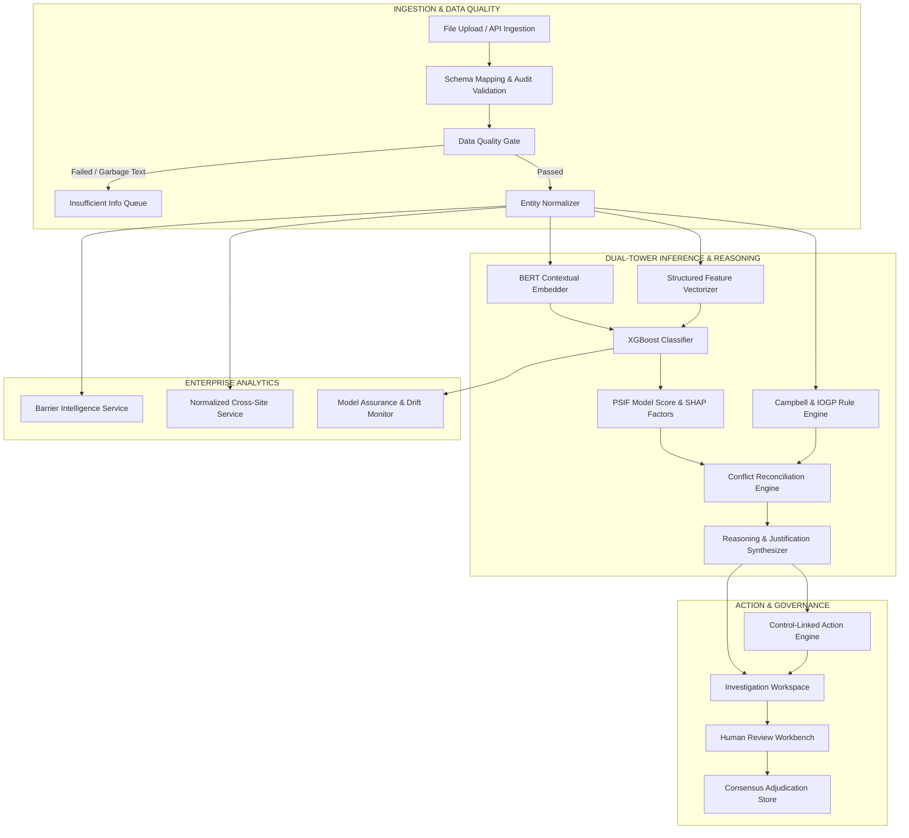

# Foresight PSIF Platform: Final System Architecture

**Document Version:** 1.0 (Frozen Demo Release)  
**Status:** Canonical & Audited  
**System Classification:** Production-Grade Technical Blueprint for Demonstration  

---

## 1. System Overview & Technology Stack

The Foresight PSIF Platform is built on a modular, decoupled Django architecture combining synchronous relational database transactions with asynchronous background task processing and GPU/CPU-accelerated machine learning inference.

```
+---------------------------------------------------------------------------------------------------+
|                                      FORESIGHT PLATFORM STACK                                     |
+---------------------------------------------------------------------------------------------------+
| Core Framework      | Django 5.1 (Python 3.14) with Django REST Framework (DRF)                   |
| Database            | PostgreSQL / SQLite with indexed JSONField support & WAL configuration      |
| Background Queue    | Celery 5.4 with Redis 7.x broker & result backend                            |
| Text Representation | HuggingFace Transformers (frozen BERT text encoder, 768-dim embeddings)    |
| Pattern Model       | XGBoost Classifier with tuned hyper-parameters & SHAP tree explainer        |
| Front-End UI        | Server-rendered Django templates + Vanilla CSS Design System + Vanilla JS   |
| Visualization       | Responsive CSS grids, HTML5 canvas/SVG charts, native micro-animations     |
+---------------------------------------------------------------------------------------------------+
```

---

## 2. End-to-End Pipeline Architecture



### Module Responsibilities:
1. **`apps/ingestion`**: Handles file uploads (CSV, XLSX), detects encoding, validates column headers, creates dataset batches, and manages asynchronous chunk processing.
2. **`apps/incidents/services/data_quality_service.py`**: Performs pre-inference quality checks (narrative length, non-dictionary ratio, required fields) and gates records.
3. **`apps/incidents/services/normalization_service.py`**: Maps unstructured locations, activities, and hazards to canonical entities with full traceability.
4. **`apps/predictions/services/ml_pipeline.py`**: Manages BERT text embedding generation, structured feature scaling, XGBoost scoring, and SHAP tree value extraction.
5. **`apps/incidents/services/psif_rule_engine.py`**: Evaluates energy, worker exposure, and critical control integrity using deterministic logic.
6. **`apps/incidents/services/decision_trace.py`**: Arbitrates conflicts between model scores and rule deductions, generating unified verdicts and explainability trees.
7. **`apps/incidents/services/action_library.py`**: Connects identified control weaknesses to auditable, recommended actions.
8. **`apps/incidents/services/review_service.py`**: Powers human-in-the-loop review, recording reviewer IDs, timestamps, and rationales without mutating model history.
9. **`apps/dashboard/cross_site_service.py`**: Normalizes and compares multi-site safety signals with neutral, defensible denominators.
10. **`apps/incidents/services/barrier_service.py`**: Analyzes the 9 IOGP Life-Saving Rules and tracks matched observations across operational facilities.

---

## 3. Database Schema & Indexing Strategy

To guarantee sub-second dashboard performance and instant search over hundreds of thousands of incident records, composite and targeted B-tree indexes are deployed across critical tables:

```
+---------------------------------------------------------------------------------------------------+
| Table / Model           | Indexed Fields                                | Purpose                  |
+-------------------------+-----------------------------------------------+--------------------------+
| incidents_incident      | status, report_type                           | Queue filtering          |
|                         | incident_date, department                     | Temporal & site queries  |
|                         | severity_actual, severity_potential           | Outcome filtering        |
|                         | is_synthetic, psif_label_source               | Provenance separation    |
|                         | adjudication_status, adjudicated_human_decis. | Human review queries     |
|                         | (department, incident_date) [Composite]       | Site timeline slicing    |
|                         | (severity_actual, severity_potential) [Comp.] | Severity cross-tabs      |
+-------------------------+-----------------------------------------------+--------------------------+
| predictions_prediction  | psif_predicted, psif_probability              | Candidate thresholds     |
|                         | is_sparse_input, evidence_strength            | Quality/confidence cuts  |
|                         | -psif_probability                             | Priority ranking         |
|                         | model_version_id                              | Model version audits     |
|                         | incident_id [OneToOne / Unique]               | 1:1 Incident join        |
+-------------------------+-----------------------------------------------+--------------------------+
| incidents_humanreview   | incident_id, decision                         | Review audit trail       |
|                         | reviewer_id, reviewed_at                      | Accountability logging   |
+-------------------------+-----------------------------------------------+--------------------------+
| incidents_iogpruletag   | incident_id, rule                             | Barrier lookups          |
+-------------------------+-----------------------------------------------+--------------------------+
```

---

## 4. Asynchronous Task Architecture & Cancellation Semantics

Background processing (dataset ingestion, batch prediction, embedding precomputation, model retraining) is managed via Celery.

### Cooperative Cancellation Protocol
To prevent database corruption or orphaned half-imported records, Foresight uses **cooperative, durable cancellation** rather than unsafe OS worker termination (`SIGKILL`):
1. User clicks "Cancel Processing" in the web UI.
2. The UI issues `POST /api/ingestion/datasets/<id>/cancel/`.
3. An atomic flag `cancel_requested = True` is stored in Redis cache and the database `Dataset` row.
4. The Celery ingestion worker checks `is_cancel_requested()` at every 100-record batch boundary.
5. Upon detecting the flag:
   - Rolling database transactions for the active chunk are rolled back.
   - Status transitions cleanly to `CANCELLED`.
   - Temporary uploaded files and scratch tensors are purged.
   - A descriptive cancellation audit record is saved.

---

## 5. Caching & Freshness Topology

Foresight uses Redis for structured caching of aggregate metrics:
- **Dashboard Overview Cache (`dashboard_overview_kpis`)**: Cached with 5-minute TTL.
- **Cross-Site Matrix Cache (`cross_site_matrices`)**: Cached with 15-minute TTL.
- **Barrier Intelligence Cache (`barrier_summary_v1`)**: Cached with 15-minute TTL.

### Cache Invalidation Triggers
Caches are automatically flushed upon:
1. Completion of a new dataset ingestion batch.
2. Activation of a new machine learning model version.
3. Batch update or deletion of incidents.
4. Execution of the manual refresh action on analytics dashboards.

---

## 6. Security & Hardening Architecture

1. **Authentication & Authorization**: Role-based access control (Admin, Safety Lead, Field Reviewer, Viewer). Review and prediction submission require write permissions.
2. **CSRF Protection**: All mutating endpoints enforce Django CSRF tokens via `X-CSRFToken` headers.
3. **Safe File Uploads**:
   - File extensions strictly validated (`.csv`, `.xlsx`).
   - File MIME types inspected via `magic`.
   - File size limited to 50MB per batch upload.
   - Safe sanitized paths preventing path-traversal attacks (`os.path.basename` enforcement).
4. **Output Escaping & XSS Defense**: Unstructured narratives and user inputs are strictly escaped in templates via Django auto-escaping and DOM `textContent` APIs.
5. **No Stack Traces in Production**: Error responses return standardized JSON error objects `{ "error": "Descriptive message", "code": "STATUS_CODE" }`.
