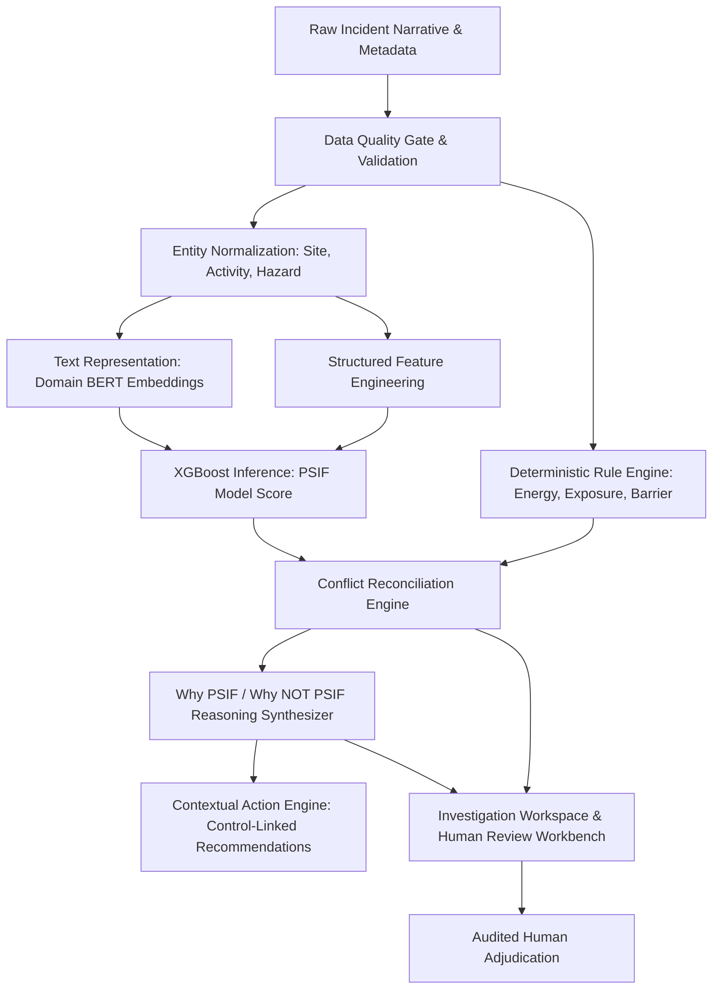

# Foresight PSIF Platform: Final System Methodology

**Document Version:** 1.0 (Frozen Demo Release)  
**Status:** Canonical & Audited  
**System Classification:** Prototype Demonstration for AI-Assisted Safety Precursor Identification  

---

## 1. Executive Overview & System Purpose

Foresight is an AI-assisted safety-intelligence prototype designed to support Health, Safety, and Environment (HSE) professionals in identifying potential Serious Injury or Fatality (PSIF) precursors within unstructured incident narratives and structured safety observation records.

The system is architected as an **adversarial, evidence-grounded hybrid intelligence platform**, uniting:
1. **Machine Learning Pattern Recognition:** Fine-tuned BERT embeddings and tuned XGBoost classification for identifying semantic indicators of severe energy and exposure.
2. **Deterministic Domain Rules:** IOGP (International Oil & Gas Producers) Life-Saving Rules and Campbell Institute Energy & Barrier principles.
3. **Structured Evidence Extraction:** Extraction of physical energy sources, worker line-of-fire exposure, and direct barrier/control conditions.
4. **Transparent Conflict Reconciliation:** A deterministic arbitration engine that synthesizes ML outputs and rule deductions into explainable verdicts.
5. **Human Review & Governance:** A segregated adjudication layer ensuring human authority is never overwritten or conflated with AI predictions.

> **Operational Disclosure:**  
> Foresight is a **prototype demonstration** developed for technology validation and design benchmarking. It is **not** an operationally certified safety system and has **not** been validated on human-reviewed OIL operational data. Operational deployment requires formal calibration and blind validation against real-world human-adjudicated enterprise datasets.

---

## 2. Canonical Semantic Contract

To prevent epistemic errors common in safety AI systems, Foresight strictly enforces a mathematical and semantic separation across all pipelines, APIs, databases, and user interfaces:

```
+---------------------------------------------------------------------------------------------------+
|                                  CANONICAL SEMANTIC INVARIANTS                                    |
+---------------------------------------------------------------------------------------------------+
| 1. UNKNOWN != NOT PSIF                 | Absence of evidence is not evidence of absence.          |
| 2. IOGP MATCH != IOGP VIOLATION        | Keyword matching identifies domain relevance, not guilt. |
| 3. SHAP CONTRIBUTION != CAUSE          | Feature attribution explains model focus, not physics.   |
| 4. MODEL SCORE != CALIBRATED PROB      | Score is an uncalibrated relative ranking score (0–1).   |
| 5. SIMILARITY != DUPLICATE             | High vector similarity does not imply identical events.  |
| 6. RECURRENCE != CAUSALITY             | Cluster frequency reflects historical record, not risk.  |
| 7. ACTION REC != CLASSIFICATION EV     | Corrective actions respond to deficiencies, not verdicts.|
+---------------------------------------------------------------------------------------------------+
```

### Primary Tri-State Classification
Every evaluated record resolves to one of three canonical external classifications:
- **`PSIF`**: A credible pathway to a fatal or life-altering event was established based on high energy, worker exposure, and compromised or absent direct controls.
- **`NOT PSIF`**: Credible evidence confirms that the energy was fundamentally low, worker exposure was physically absent, or direct engineered controls reliably arrested the hazard.
- **`INSUFFICIENT INFORMATION`**: Narrative or metadata lacks sufficient detail to determine whether high energy, exposure, or control failure occurred. **Sparse records are never defaulted to `NOT PSIF`**.

### Internal Reasoning States
Internal arbitration resolves into five well-defined evidentiary states:
1. `PSIF_PATHWAY_OPEN`: High-energy hazard present, worker exposed in the hazard zone, and direct control failed, bypassed, or missing.
2. `HIGH_ENERGY_CONTROLLED`: High-energy hazard was present, but robust, verified direct engineered barriers successfully isolated or contained the energy.
3. `LOW_ENERGY`: Incident involved only low-energy mechanisms incapable of causing fatal or permanent, life-altering trauma.
4. `INSUFFICIENT_INFORMATION`: Essential facts regarding energy magnitude, worker position, or barrier state are missing or ambiguous.
5. `CONFLICTING_EVIDENCE`: Rule engine and statistical model arrive at opposing conclusions, triggering automated evidentiary breakdown and prioritizing human safety review.

---

## 3. End-to-End Traceable Reasoning Pipeline

The complete Foresight analytical pipeline follows a strictly ordered, traceable handoff:



### 1. Ingestion & Pre-Processing
- Multi-format ingestion (CSV, XLSX, REST API) with field mapping validation.
- Original raw input row preserved immutably in `raw_row` JSON field for end-to-end auditability.

### 2. Data Quality (DQ) Gate
- Evaluates completeness, minimum narrative length (>15 characters), token count, and placeholder text detection.
- Records failing critical quality criteria are assigned `INSUFFICIENT_INFORMATION` and routed to the remediation queue without model scoring.

### 3. Entity Normalization
- Canonical mapping for operational Sites (e.g., preserving distinct facilities like Duliajan vs. Digboi while mapping common aliases).
- Standardization of Activities (e.g., distinguishing mechanical lifting from routine handling) and Hazard classes.

### 4. Machine Learning Scoring
- Dual-tower representation: 768-dimensional contextual embeddings fused with one-hot structured operational features.
- Model produces a **PSIF Model Score** ($0.0 \le s \le 1.0$) relative to the active operational decision threshold ($T \approx 0.50$).
- **Strict Principle:** The score is never represented as an empirical real-world probability of death or injury.

### 5. Rule-Based Forensic Extraction
- Evaluates the presence of high-energy sources (pressure $>150$ psi, height $>1.8$m, high voltage, heavy rotating equipment).
- Determines worker line-of-fire positioning.
- Inspects barrier status: whether engineered controls held, failed, were bypassed, or were absent.

### 6. Conflict Reconciliation
- Compares rule-based evidence against ML score.
- If rule engine confirms high-energy exposure with compromised controls, PSIF pathway is flagged even if ML score is marginal.
- If rule engine confirms verified control hold, prevents false alarm escalation while noting any residual risks.

### 7. Action Engine Linkage
- Corrective actions are generated exclusively through traceable links to identified control deficiencies (e.g., LOTO bypass triggers isolation verification audits).
- Generic safety slogans or ungrounded recommendations are strictly rejected.
- Actions are purely downstream and never feedback into incident classification.

---

## 4. Explainability & Justification Architecture

### "Why PSIF" Explanation Contract
For incidents classified as `PSIF`, the user interface and API provide an 8-point justification:
1. **Identified High-Energy Hazard:** Specific energy source identified in narrative (e.g., 5000 psi pressurized line).
2. **Worker Exposure:** Spatial or operational evidence placing personnel in the line of fire.
3. **Critical Control Deficiency:** Specific failure, bypass, or absence of direct engineered barriers.
4. **Credible Severe Consequence:** Articulation of the plausible life-altering outcome.
5. **Evidence Source:** Direct textual excerpts grounding the assessment.
6. **Model Contribution:** SHAP feature importance explaining model feature weighting.
7. **Rule Contribution:** Triggered IOGP Life-Saving Rules or barrier rules.
8. **Final Reconciliation:** Transparent logic explaining how model and rule findings were combined.

### "Why NOT PSIF" Explanation Contract
For incidents classified as `NOT PSIF`, the system provides a defensible explanation of **what interrupted the credible SIF pathway**:
- **Low-Energy Mechanism:** Kinetic or stored energy was well below lethal thresholds (e.g., minor paper cut, office ergonomic discomfort).
- **No Worker Exposure:** High-energy event occurred in an engineered exclusion zone with no personnel in the danger area.
- **Effective Critical Control:** Direct engineered safety barrier functioned as designed and completely arrested the hazard.
- **Consequence Pathway Unsupported:** Physics of the event could not credibly lead to a fatal outcome.
- **Forbidden Wording:** Explanations stating merely *"Not PSIF because the model score was low"* are prohibited by system policy.

---

## 5. Human Review & Adjudication Protocol

Foresight strictly preserves human primacy in all safety decisions:
1. **Non-Destructive Review:** Submitting an HSE reviewer decision records `adjudicated_human_decision`, `adjudicated_by`, and `adjudication_rationale`. The historical `PredictionResult` (model score, SHAP values, prediction) is immutable and permanently preserved.
2. **Consensus Tracking:** Disagreements between human reviewers and model predictions are surfaced as valuable model calibration signals.
3. **Synthetic Label Segregation:** Demonstrations using simulated review scripts must set `is_synthetic_adjudication = True`. They are never conflated with genuine human expert adjudication.

---

## 6. Disclosed Methodological Limitations

1. **Uncalibrated Model Scores:** Model outputs reflect rank-order statistical similarity to training precursors, not actuarial probability of injury.
2. **Deterministic Keyword Rules:** IOGP rule matches represent heuristic keyword alignments, not definitive legal or operational violations.
3. **Non-Causal SHAP Values:** SHAP values represent statistical feature weighting in the gradient-boosted trees, not physical root causes.
4. **Historical Recurrence:** Recurrence patterns reflect reporting volume and reporting habits across sites, not predictive future risk.
5. **Synthetic Precursors:** Benchmark datasets derived from synthetic or semi-synthetic augmentation may reflect generation artifacts and require field validation on genuine operating company records.
